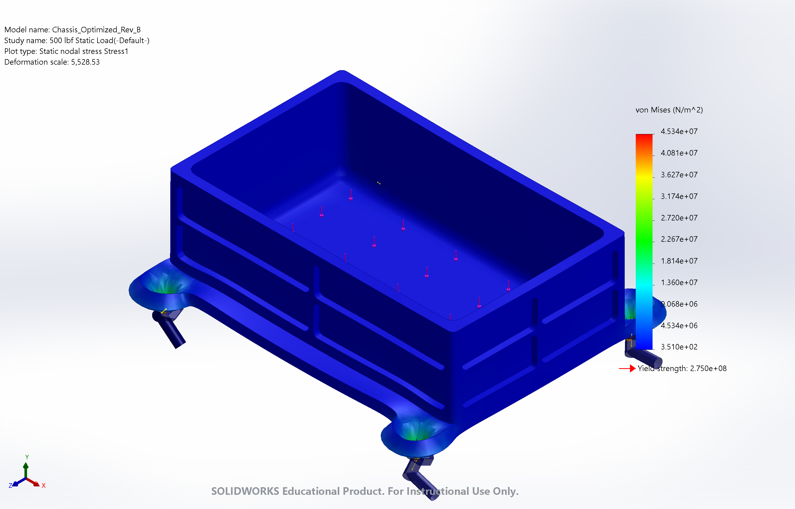
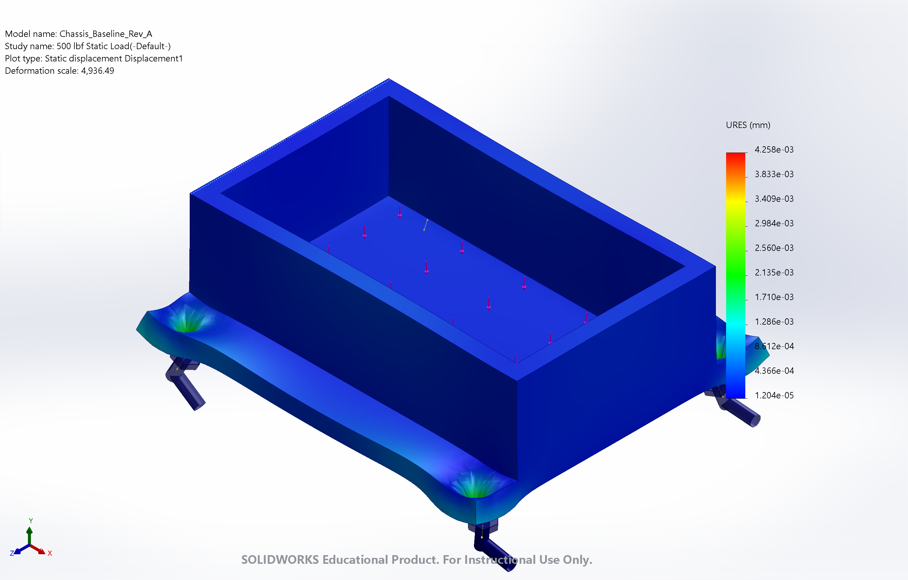
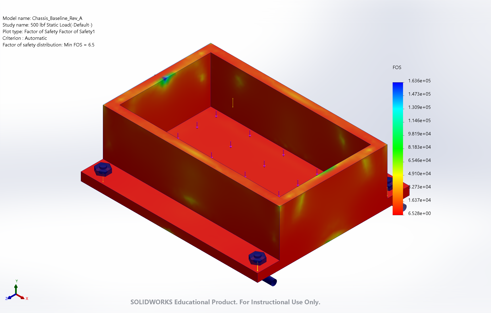
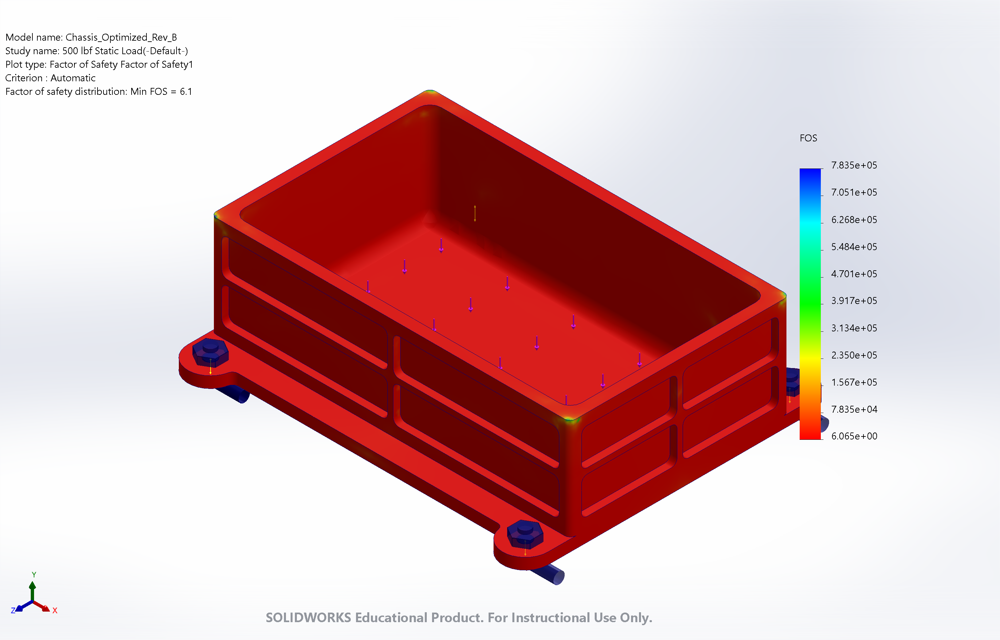
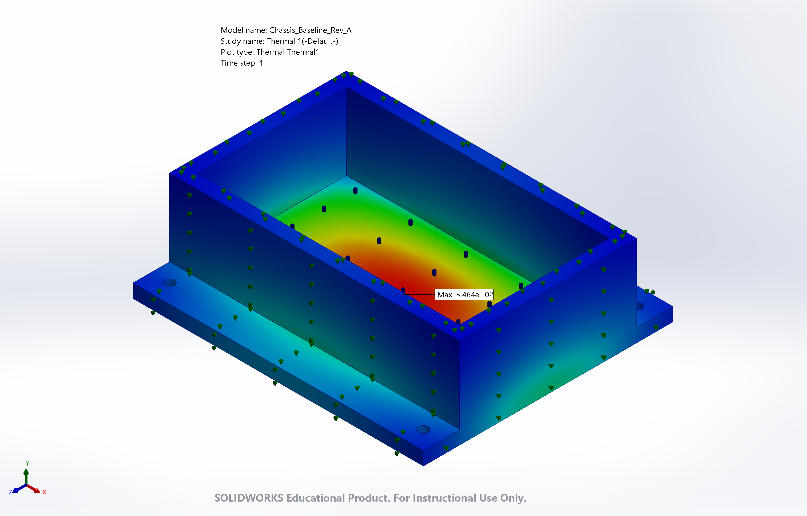
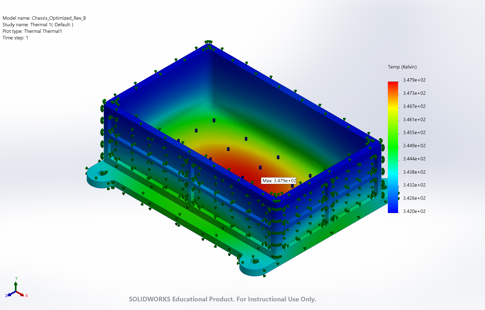

# 1/2 ATR Avionics Chassis Structural & Thermal Optimization (Rev A vs. Rev B)

## Project Overview
This repository contains the finite element analysis (FEA) structural and thermal trade study for a 1/2 ATR (Air Transport Radio) avionics enclosure fabricated from 6061-T6 aluminum. The objective was to aggressively lightweight a solid baseline structure (Rev A) while maintaining structural integrity under a 500 lbf static load and preserving thermal dissipation capacity.

---

## Performance Comparison (Rev A vs. Rev B)

| Parameter / Metric | Rev A (Baseline Solid) | Rev B (Optimized Waffle-Grid) | Delta / Optimization Impact |
| :--- | :--- | :--- | :--- |
| **Mass** | 3.89 lbs | 1.99 lbs | **-48.8% Mass Reduction** |
| **Min Factor of Safety (FOS)** | 6.5 (6.528e+00) | 6.1 (6.065e+00) | -0.4 (High structural margin preserved) |
| **Max von Mises Stress** | 42.13 MPa (4.213e+07 N/m²) | 45.34 MPa (4.534e+07 N/m²) | +7.6% Stress increase |
| **Max Displacement (URES)** | 4.258e-03 mm | 3.771e-03 mm | **-11.4% Displacement reduction (stiffer)** |
| **Max Temperature** | 346.4 K (73.25°C) | 347.9 K (74.75°C) | +1.5 K (+1.5°C) Minor thermal penalty |
| **Material Yield Strength** | 275 MPa (2.750e+08 N/m²) | 275 MPa (2.750e+08 N/m²) | 6061-T6 Aluminum Limit |

---

## Visual FEA Comparison Matrix

| Analysis Type | Rev A (Baseline Solid) | Rev B (Optimized Waffle-Grid) |
| :--- | :---: | :---: |
| **von Mises Stress** |  |  |
| **Displacement** |  |  |
| **Factor of Safety** |  |  |
| **Thermal Contour** |  |  |

---

## Design Features & Engineering Rationale

1. **Mass Reduction & Wall Topology:**
   - Reduced wall thickness from a uniform 0.375" down to a pocketed 2x2 grid with 0.090" residual webs and 0.100" stiffening ribs.
   - Reduced component mass by 1.90 lbs (~48.8%) while maintaining a minimum Factor of Safety of 6.1 under 500 lbf static floor load.

2. **Stress Concentration Mitigation:**
   - Implemented 0.125" internal pocket radii, matching standard 1/4" end mills to reduce CNC tool chatter and prevent stress risers.
   - Applied 0.250" vertical and floor-to-wall fillets to transition bending moments smoothly from the base floor into the side walls.

3. **Thermal Management Trade-off:**
   - Side-wall pocketing increased external convective surface area ($Q = h A \Delta T$).
   - Thinning the walls slightly reduced the total thermal conduction cross-section, resulting in a minor $1.5^\circ\text{C}$ temperature increase ($346.4\text{ K} \rightarrow 347.9\text{ K}$)—well within typical avionics operational limits ($\le 85^\circ\text{C}$).

4. **Design for Manufacturing & Fasteners:**
   - Preserved full 0.250" flange thickness around bolt pads to handle 750 lbf preload forces without local yielding.
   - Scalloped non-load-bearing flange sections between bolt holes to eliminate stray mass.

---

## Repository Structure

```text
├── CAD/
│   ├── Chassis_Baseline_Rev_A.SLDPRT
│   └── Chassis_Optimized_Rev_B.SLDPRT
├── Plots_and_Renders/
│   ├── Baseline_Static_VonMises_Stress.png
│   ├── Baseline_static_Displacement.png
│   ├── Baseline_Static_FactorOfSafety.png
│   ├── Baseline_Thermal_Contour.png
│   ├── Optimized_Static_VonMises_Stress.png
│   ├── Optimized_Static_Displacement.png
│   ├── Optimized_Static_FactorOfSafety.png
│   └── Optimized_Thermal_Dissipation.png
└── README.md
